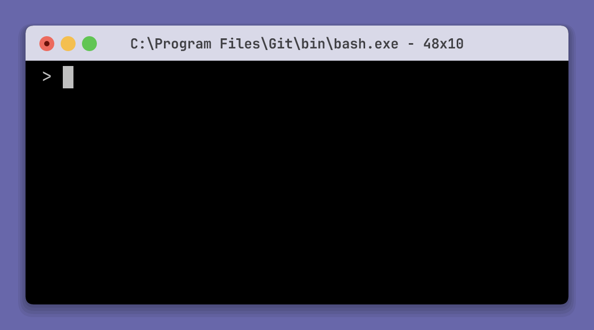
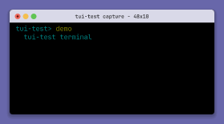
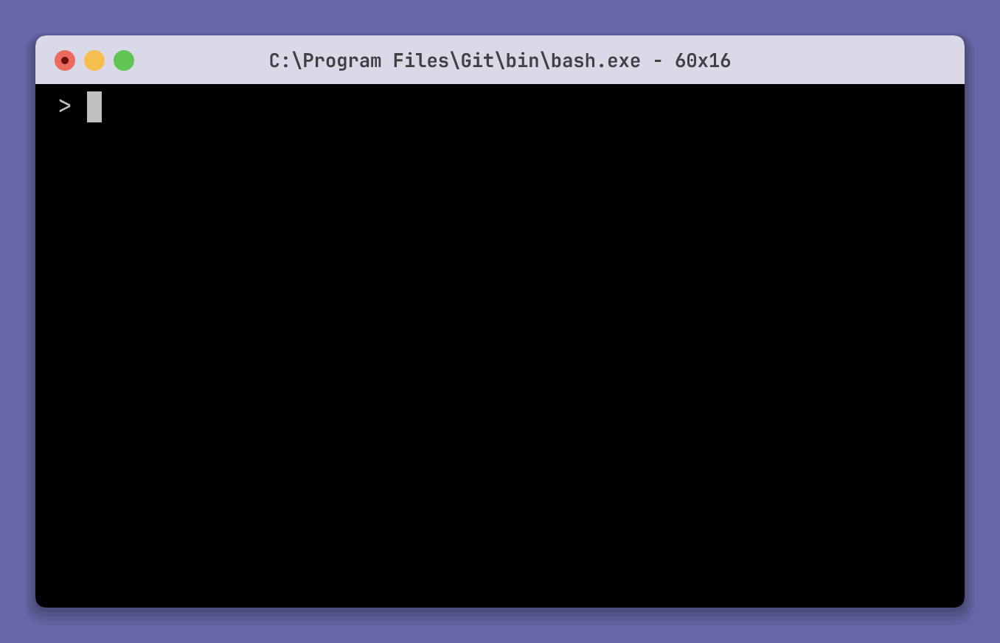

# tui-test

`tui-test` controls, inspects, tests, and records real shell sessions and
terminal applications. Use it from the CLI or run the same engine in process
from Rust, Python, or JavaScript. It supports Windows, Linux, macOS, and a
wide range of [shells](#supported-shells).

<p align="center">
  <a href="#installation">Installation</a>
  ·
  <a href="#quick-start">Quick start</a>
  ·
  <a href="#cli-reference">CLI reference</a>
  ·
  <a href="#configuration">Configuration</a>
</p>

> [!IMPORTANT]
> `tui-test` is in the middle of a major rewrite. This documentation covers
> the beta releases.

## Features

- Drive shells and full-screen TUI programs with keyboard, mouse, resize, and
  signal input.
- Inspect terminal text, colors, cells, cursor state, titles, command output,
  and exit codes.
- Wait for terminal state or assert on text, output, colors, snapshots, and
  process results.
- Capture SVG screenshots, APNG/GIF/MP4 recordings, and asciinema casts.
- Run from the CLI or use the Rust, Python, and JavaScript libraries.

## Installation

Choose the CLI for shell scripts and agent workflows. Choose a programmatic
library to run the engine inside an application or test process.

<details open>
<summary><strong>CLI</strong></summary>

### macOS and Linux

```sh
curl --proto '=https' --tlsv1.2 -LsSf https://raw.githubusercontent.com/microsoft/tui-test/main/install/install.sh | sh
```

### Windows

```powershell
irm https://raw.githubusercontent.com/microsoft/tui-test/main/install/install.ps1 | iex
```

Set `TUI_TEST_VERSION` to install a specific version or
`TUI_TEST_INSTALL_DIR` to choose the install location.

### Release binaries

Download the latest beta for your platform from
[GitHub Releases](https://github.com/microsoft/tui-test/releases).

</details>

<details>
<summary><strong>Programmatic</strong></summary>

The libraries run the engine in process and do not require the CLI.

<details>
<summary><strong>Rust</strong></summary>

Install [`tui-test-rs`](https://crates.io/crates/tui-test-rs):

```sh
cargo add tui-test-rs@0.1.0-beta.1
# Add APNG/GIF/MP4 export support when the Rust application needs raster recording:
cargo add tui-test-rs@0.1.0-beta.1 --features recording-raster
```

Raster recording uses installed system fonts unless a JetBrains Mono bundle
feature is enabled:

| Feature | Bundled JetBrains Mono faces |
| --- | --- |
| `recording-raster` | None; use installed system fonts |
| `recording-font-jetbrains-mono` | Full-glyph Regular |
| `recording-font-jetbrains-mono-styles` | Regular, Bold, Italic, and Bold Italic |
| `recording-font-jetbrains-mono-full` | All 16 static family faces |

Each font feature enables `recording-raster`; the tiers are cumulative.

</details>

<details>
<summary><strong>Python</strong></summary>

Install [`tui-test`](https://github.com/microsoft/tui-test/blob/main/bindings/python/README.md)
for Python 3.8 or later:

```sh
pip install --pre tui-test
```

</details>

<details>
<summary><strong>JavaScript</strong></summary>

Install
[`@microsoft/tui-test`](https://github.com/microsoft/tui-test/blob/main/bindings/js/README.md):

```sh
npm install @microsoft/tui-test@beta # Node 20+

bun add @microsoft/tui-test@beta # Bun (best effort)

deno add npm:@microsoft/tui-test@beta # Deno 2 (best effort)
```

Node is the supported runtime. Bun and Deno compatibility is best effort.
Deno requires a local `node_modules` directory and `--allow-ffi` to load the
native addon.

</details>

</details>

## Quick start

### CLI

Run a command and check the result:

```sh
tui-test open                  # start a shell session (auto-starts the daemon)
tui-test submit "echo hello"   # type the command, press Enter
tui-test wait command          # block until it finishes
tui-test expect text "hello"   # assert it showed up
tui-test expect exit-code 0    # assert it exited 0
tui-test close
```

Drive a full-screen TUI:

```sh
tui-test run vim file.txt
tui-test wait idle             # let the screen settle
tui-test key press i
tui-test type "some text"
tui-test key press Escape : w q Enter
tui-test wait exit
```

### Rust

```rust
use tui_test::{OpenOptions, Operation, Session};

fn main() -> Result<(), Box<dyn std::error::Error>> {
    let session = Session::new(format!("rust-example-{}", std::process::id()));
    session.open(OpenOptions::default())?;
    session.execute(Operation::Submit {
        data: Some("echo hello".into()),
    })?;
    session.execute(Operation::WaitCommand {
        timeout_ms: Some(30_000),
    })?;
    session.execute(Operation::ExpectText {
        text: "hello".into(),
        regex: false,
        full: false,
        strict: false,
        not: false,
        fg: None,
        bg: None,
        timeout_ms: Some(5_000),
    })?;
    session.execute(Operation::ExpectExitCode {
        code: 0,
        timeout_ms: Some(5_000),
    })?;
    session.close()?;
    Ok(())
}
```

### Python

```python
import asyncio
from tui_test import TuiTest

async def main():
    async with TuiTest() as su:
        await su.open()
        await su.submit("echo hello")
        await su.wait_command()
        await su.expect_text("hello")
        await su.expect_exit_code(0)

asyncio.run(main())
```

### JavaScript

```js
import { TuiTest } from "@microsoft/tui-test";

const su = new TuiTest();
await su.open();
await su.submit("echo hello");
await su.waitCommand();
await su.expectText("hello");
await su.expectExitCode(0);
await su.close();
```

## Agent integration

`tui-test` includes CLI commands that help agents discover and use it:

| Command | Description |
| --- | --- |
| `agent-context` | Print versioned JSON for every command, flag, enum, default, and exit code. The running CLI generates the JSON, so it stays in sync. |
| `usage` | Print a one-screen cheatsheet. |
| `skill` | Print the full workflow guide from [`SKILL.md`](https://github.com/microsoft/tui-test/blob/main/SKILL.md). |

### Install the agent skill

```sh
tui-test skill --add
```

The command adds the `tui-test` skill to the location selected in the TUI.

Each command returns a stable exit code (see [Exit codes](#exit-codes)), so an agent can tell an assertion failure from a missing session without scraping text.

## CLI reference

Global flags: `--session <name>` (env `TUI_TEST_SESSION`, default `default`), `--json` for machine-readable output, and `--verbose`/`-v` to log PTY traffic (see [Debugging](#debugging)).

### Sessions

#### Timeouts

Waits and assertions fall into five timeout classes:

| Class | Applies to | Default |
| --- | --- | --- |
| `text` | `expect text`, `wait text`, `expect title`, `wait title`, `wait bell`, `expect bell` | 5000 ms |
| `idle` | `wait idle` | 5000 ms |
| `command` | `wait command`, `expect exit-code` | 30000 ms |
| `exit` | `wait exit` | 30000 ms |
| `ready` | `wait ready`, and the prompt wait inside `open` | 30000 ms |

`open`'s prompt wait caps at 8000 ms unless you set a `ready` timeout.

Set a session default at `open`, override it per call:

```sh
tui-test open --timeout-text 30000 --timeout-idle 15000 --timeout-ready 20000
tui-test wait text "done" --timeout 60000   # just this call
```

Precedence: `--timeout`, then the session default from `open`/`run`, then
`TUI_TEST_TIMEOUT_<CLASS>_MS` (read when the daemon starts). `tui-test state`
prints a session's effective timeouts.

#### Lifecycle

| Command                                                      | Description                                 |
| ------------------------------------------------------------ | ------------------------------------------- |
| `open [--shell S] [--backend B] [--cols N --rows N] [--cwd D] [--env K=V] [--config F] [--profile P] [--timeout-<class> MS] [--restart]` | Spawn or reuse a shell session.             |
| `run [--backend B] [--config F] [--profile P] [--restart] <program> [args...]` | Spawn or reuse a session running a program. |
| `sessions`                                                   | List active sessions.                       |
| `close [--all]`                                              | Close the current session (or all).         |
| `daemon start` / `daemon status` / `daemon stop --session N \| --all` | Start, inspect, or stop a session's daemon. |

Each session has its own daemon, so `daemon stop` needs `--session <name>` or
`--all`. `close` stops it too.

When a client finds a daemon from another `tui-test` version, it shuts that
daemon down and starts the current version before sending the command. The
restart is serialized per session so concurrent clients cannot race.

`open` waits for a prompt before returning, `run` does not. Override with
`--wait-ready` / `--no-wait-ready`. An explicit `--wait-ready` fails (exit 1) if
no prompt appears; `open`'s implicit wait reports `ready` in its payload either
way.

Calling `open` or `run` for a session that already has a live child reuses that
child. Pass `--restart` (or its `--force` alias) to replace it explicitly.

#### Terminal backends

Choose an emulator per session with `--backend alacritty|ghostty`. Alacritty
remains the default; `ghostty` uses
[Ghostty's Rust VT bindings](https://github.com/Uzaaft/libghostty-rs).

```sh
tui-test open --backend ghostty
tui-test run --backend ghostty vim file.txt
```

Both backends run the same conformance suite and feed the same renderer,
assertions, and snapshots. Shell semantic-prompt tracking stays on the raw PTY
byte stream, so command, exit-code, and cwd behavior is backend-independent.
Ghostty also preserves SGR blink; Alacritty parses blink but cannot report it.

The CLI and published Python and JavaScript native packages include both
backends.
Windows ARM64 artifacts are not currently published because Ghostty's
upstream Zig build does not support that target.

Rust users opt in explicitly:

```sh
cargo add tui-test-rs --features ghostty
```

```rust
use tui_test::{Backend, OpenOptions};

let options = OpenOptions {
    backend: Backend::Ghostty,
    ..OpenOptions::default()
};
```

Building the `ghostty` feature from source requires Zig 0.16 on `PATH`;
the dependency builds a pinned Ghostty revision. The default Rust feature set
continues to build only the Alacritty backend and does not require Zig.

### Terminal control

#### Inspection

| Command                                             | Description                                                                                 |
| --------------------------------------------------- | ------------------------------------------------------------------------------------------- |
| `state`                                             | cwd, size, cursor, window title, last command + exit code, bell count, effective timeouts, text snapshot. |
| `text [--full]`                                     | Plain text of the viewport (or scrollback).                                                 |
| `screenshot [-o file.svg] [--full] [--zoom N]`      | Terminal text to stdout, or a full-color SVG scaled without changing its terminal cells.   |
| `cells X Y [W H]`                                   | Per-cell attributes (char, fg, bg, flags).                                                  |
| `get command\|output\|exit-code\|cwd\|cursor\|size\|title\|bells\|bell-events` | Structured getters.                                                                   |

`state` prints `key: value` lines then the screen; `text` and `screenshot`
print the screen bare.

#### Input

| Command                                                       | Description                                                  |
| ------------------------------------------------------------- | ------------------------------------------------------------ |
| `type "text"`                                                 | Type literal text.                                         |
| `submit ["text"]`                                             | Type then press the shell return key.                      |
| `key press <Key...>`                                          | Simulate key presses, e.g. `key press Ctrl+C`.             |
| `key down <Key...>` / `key up <Key...>`                       | Simulate explicit keydown and keyup events.                |
| `key repeat <Key...>`                                         | Send repeat events (press-equivalent in legacy mode).      |
| `mouse click X Y` / `mouse click --on-text "OK" [--clicks N]` | Click by coords or label.                                  |
| `mouse move\|down\|up\|drag\|scroll ...`                      | Full mouse control.                                        |

Key input follows the Kitty keyboard protocol negotiated by the child. A
`key press` sends the normal press input and adds a release only when the child
requests Kitty event-type reporting. Text-producing keys also require
report-all-keys mode before repeat and release events can be represented.
Modifiers are `Ctrl`, `Alt` / `Option`, `Shift`, `Super`, `Hyper`, and `Meta`;
the top-level `press` command remains a compatibility alias for `key press`.

#### PTY control

| Command                           | Description                      |
| --------------------------------- | -------------------------------- |
| `resize COLS ROWS`                | Resize the PTY and emulator.     |
| `write <data>`                    | Write raw bytes (no return key). |
| `signal INT\|TERM\|KILL` / `kill` | Signal / kill the child.         |

### Waiting and assertions

#### Wait

| Command                                             | Description                         |
| --------------------------------------------------- | ----------------------------------- |
| `wait text "T" [--regex --full --not --timeout MS]` | Until text is (not) visible.        |
| `wait title "T" [--regex --not --timeout MS]`       | Until the window title (OSC 0/2) matches. |
| `wait idle`                                         | Until the screen stops changing.    |
| `wait command`                                      | Until the current command finishes. |
| `wait exit`                                         | Until the session exits.            |
| `wait ready`                                        | Until the shell reports a prompt.   |
| `wait bell`                                         | Until the next terminal bell event. |

#### Expect (exit 0 = pass, 1 = fail)

| Command                                                                         | Description                                |
| ------------------------------------------------------------------------------- | ------------------------------------------ |
| `expect text "T" [--regex --full --no-strict --not --fg C --bg C --timeout MS]` | Visibility + optional color.               |
| `expect title "T" [--regex --not --timeout MS]`                                 | Window title set with OSC 0/2.             |
| `expect exit-code N [--timeout MS]`                                             | Last command's exit code.                  |
| `expect output "T" [--regex]`                                                   | Last command's captured output.            |
| `expect bell N [--timeout MS]`                                                  | Cumulative bell count reaches at least N.  |
| `expect snapshot NAME [-u] [--include-colors --include-title]`                                  | Compare against `__snapshots__/NAME.snap`. `--include-title` adds the window title to the frame. |

Colors accept ANSI-256 (`9`), hex (`#ff0000`), or rgb (`255,0,0`).

### Captures

#### Screenshots

Screenshots render a snapshot of the session in the current terminal by
default, but can render an SVG using the `-o` output flag. `--zoom 0.5`
halves the image dimensions while preserving the same rows and columns. Nerd
Font icons are embedded as vector paths, so SVGs remain self-contained without
changing the font stack for regular text.
Rendered screenshots and recordings append `COLSxROWS` to the program title;
when the terminal has no title they use `tui-test capture - COLSxROWS`.

<p align="center">
  
</p>

#### Recording

Record a selected part of a session directly to animated APNG (primary), GIF
(fallback), MP4 video, or standard
[asciinema v2](https://docs.asciinema.org/manual/asciicast/v2/) cast:

| Command | Description |
| --- | --- |
| `record start OUT [--format apng\|gif\|mp4\|cast] [--fps N] [--speed N] [--idle-time-limit SEC] [--zoom N]` | Start recording. Format is inferred from `.png`/`.apng`, `.gif`, `.mp4`, or `.cast`. |
| `record stop` | Stop recording and finish the output file. |
| `get-recording [session]` | Print the separate, always-on session cast to stdout. |

```sh
tui-test open
tui-test record start demo.png --zoom 0.5
tui-test submit "echo hello"
tui-test wait command
tui-test record stop
```

APNG keeps full 24/32-bit color. APNG, GIF, and MP4 render at 2x pixel density
for sharper text; `--zoom` multiplies those dimensions, so `--zoom 0.5`
produces a 1x-size export with the same terminal cells. GIF additionally uses
palette quantization for viewers that cannot display APNG. MP4 export streams
rendered frames to `ffmpeg` using H.264, and starting an MP4 recording fails
immediately unless `ffmpeg` is available on `PATH`. Defaults are 30 fps, 1x
speed, 1x zoom, a 5-second idle-gap limit, and a 3-second final hold. Zoom does
not apply to cast output. If a process exits before `record stop`, APNG/GIF/MP4
capture remains beside the target as `OUT.tui-test.cast`.

Raster export uses the selected JetBrains Mono bundle tier, when enabled, plus
installed system fonts for Unicode fallbacks. The CLI and language bindings
enable the styled tier; `recording-raster` alone stays system-font-only. Set
`TUI_TEST_RECORDING_FONT_FAMILIES=Family One,Family Two` to prioritize specific
installed families. Export fails with the missing code points instead of
silently substituting unsupported glyphs.

<p align="center">
  
</p>

The same 48x10-cell recording rendered at native 100%, 50%, and 25% zoom:

<p align="center">
  <strong>100%</strong><br>
  
</p>

<p align="center">
  <strong>50%</strong><br>
  
</p>

<p align="center">
  <strong>25%</strong><br>
  
</p>

Resize events keep the encoded canvas stable while existing terminal content
reflows as the window grows and shrinks in place:

<p align="center">
  
</p>

Regenerate the checked-in SVG, APNG, GIF, Nerd Font, and resize examples with:

```sh
bash scripts/regenerate-static-media.sh
```

The manually captured `static/tui-test-demo.mp4` is intentionally left unchanged.

Every session also records automatically from open in `.cast` format. Export it
with `tui-test get-recording > demo.cast` for the wider asciicast ecosystem.
This interoperability is implemented directly from the public asciicast v2
format and does not add or depend on GPL tooling.

### Live monitor

Watch a live session in a second terminal while an agent drives it. Both share
the same daemon. `monitor` takes over an alternate screen and streams the
session in full color at ~20fps; press `q`, `Esc`, or `Ctrl-C` to detach.

In-process Python and JavaScript sessions cannot be monitored from another
process.

https://github.com/user-attachments/assets/741c985f-7861-41c5-9ceb-0f82f705b43f

| Command   | Description                                                                       |
| --------- | --------------------------------------------------------------------------------- |
| `monitor` | Attach a live, full-color framed view of the session (`--session` selects which). |

```sh
tui-test --session work monitor   # watch the 'work' session live
```

It needs an interactive terminal (exit `2` otherwise) and an existing session
(exit `3` if none). The view reads only the shared screen state, so watching
never blocks the commands the agent is running, and resizing the window just
re-fits the frame.

### Exit codes

Every command returns a stable exit code so an agent can branch on the failure class without parsing text:

| Code | Meaning                                               |
| ---- | ----------------------------------------------------- |
| `0`  | success                                               |
| `1`  | assertion or wait condition not met (`expect`/`wait`) |
| `2`  | usage / invalid argument                              |
| `3`  | no active session (run `open`/`run` first)            |
| `4`  | daemon or IPC error                                   |
| `5`  | internal error                                        |

With `--json`, failures also carry a `"kind"` field (`assertion`/`usage`/`no_session`/`internal`).

## Configuration

### Profiles

Settings live in a `tui-test.toml` with named profiles. Everything is
optional, so a file only states what it changes:

```toml
[profiles.default]
scrollback = 10000            # rows kept beyond the visible screen

[profiles.default.colors]
background = "#000000"
foreground = "#c0c0c0"
cursor     = "#c0c0c0"
red        = "#800000"        # any of the 16 ANSI slots, by name

[profiles.ci]
scrollback = 500              # other fields use built-in defaults
```

```bash
tui-test open                         # profile "default"
tui-test open --profile ci
tui-test open --config ./other.toml --profile ci
```

Looked up nearest first: `./tui-test.toml`, then
`~/.tui-test/tui-test.toml`. `--config` or `TUI_TEST_CONFIG` replaces the
search.

Named profiles do not inherit from `[profiles.default]`; every omitted field
uses tui-test's built-in default. `tui-test.toml` affects only the CLI. The
libraries accept profile configurations when starting a new session.

### Colors

A terminal grid stores colour *indices*, not colours. What index 1 looks like
is the profile's choice, and tui-test needs that choice twice: to draw a
screenshot, and to answer `expect --fg "#rrggbb"`. **Both read the same table**,
so a colour an assertion matches is the colour a screenshot paints.

Only the 16 ANSI slots and the three defaults are configurable. Indices 16-255
are the xterm colour cube and grey ramp, fixed by the spec, so `--fg 196` means
the same thing in every profile.

The shipped palette is the classic VGA/xterm one that `TERM=xterm-256color`
promises.

## Compatibility

### Supported shells

- bash
- zsh
- fish
- PowerShell (`powershell` and `pwsh`)
- xonsh
- elvish
- nushell
- cmd

### Comparison

|                                      | tui-test                                        | [tui-use](https://github.com/onesuper/tui-use) | [terminal-use](https://github.com/flipbit03/terminal-use) |
| ------------------------------------ | ------------------------------------------------ | ---------------------------------------------- | --------------------------------------------------------- |
| Language                             | Rust                                             | TypeScript/Node                                | Rust                                                      |
| Emulator                             | alacritty or Ghostty, per session                | xterm (headless)                               | alacritty                                                 |
| Shell command tracking               | Yes: command boundaries, exit codes, cwd         | No                                             | No                                                        |
| Testing / snapshots                  | Yes: `expect` text / output / exit-code / snapshot | No                                           | No                                                        |
| Color and per-cell attributes        | Yes: fg/bg, ANSI-256/hex/RGB, `cells`            | No: plain text with highlights                 | Via PNG                                                   |
| Image screenshots                    | Yes: SVG                                         | No                                             | Yes: PNG                                                  |
| Built-in recording                   | Yes: APNG/GIF/MP4 export and asciinema casts     | No                                             | No                                                        |
| Live monitor view                    | Yes                                              | No                                             | Yes                                                       |
| Stable exit-code taxonomy for agents | Yes                                              | No                                             | No                                                        |
| Python and JavaScript bindings       | Yes                                              | No                                             | No                                                        |
| Runtime                              | native                                           | Node.js                                        | native                                                    |
| Platforms                            | Windows and Unix                                 | Windows and Unix                               | Linux and macOS                                           |

## Debugging

By default the daemon writes no log. Start it with `--verbose` to record every byte read from and written to the PTY, plus lifecycle events, to `~/.tui-test/<session>.log`.

## Contributing

This project welcomes contributions and suggestions. Most contributions require you to agree to a
Contributor License Agreement (CLA) declaring that you have the right to, and actually do, grant us
the rights to use your contribution. For details, visit https://cla.opensource.microsoft.com.

When you submit a pull request, a CLA bot will automatically determine whether you need to provide
a CLA and decorate the PR appropriately (e.g., status check, comment). Simply follow the instructions
provided by the bot. You will only need to do this once across all repos using our CLA.

This project has adopted the [Microsoft Open Source Code of Conduct](https://opensource.microsoft.com/codeofconduct/).
For more information see the [Code of Conduct FAQ](https://opensource.microsoft.com/codeofconduct/faq/) or
contact [opencode@microsoft.com](mailto:opencode@microsoft.com) with any additional questions or comments.

## Trademarks

This project may contain trademarks or logos for projects, products, or services. Authorized use of Microsoft
trademarks or logos is subject to and must follow
[Microsoft's Trademark & Brand Guidelines](https://www.microsoft.com/en-us/legal/intellectualproperty/trademarks/usage/general).
Use of Microsoft trademarks or logos in modified versions of this project must not cause confusion or imply Microsoft sponsorship.
Any use of third-party trademarks or logos are subject to those third-party's policies.
