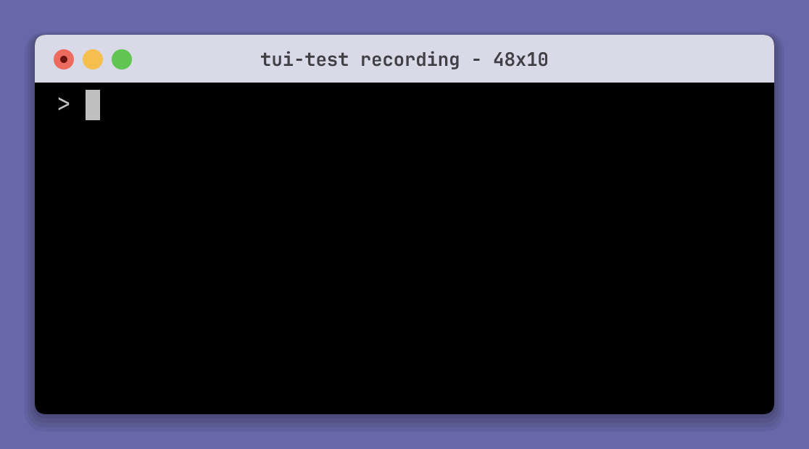
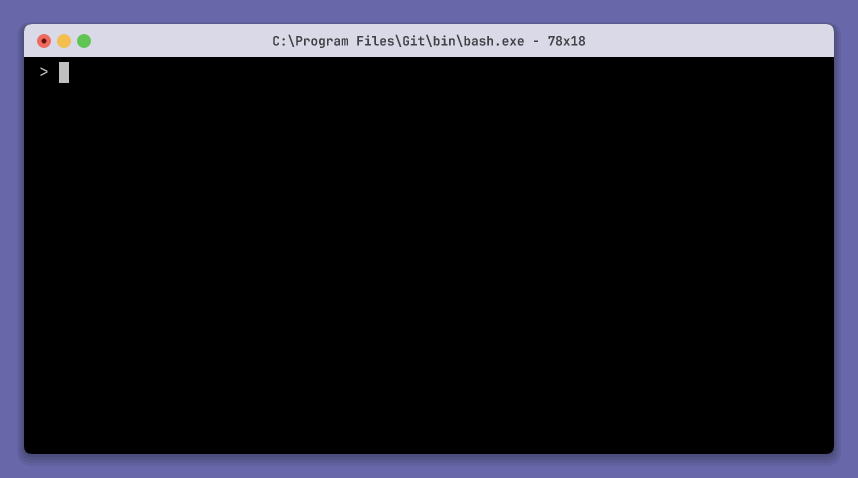

# tui-test

`tui-test` controls, inspects, tests, and records real shell sessions and full-screen terminal apps on Windows, Linux, and macOS. Use it from the CLI or call the same engine from Rust, Python, or JavaScript. It works for AI agents that need structured access to terminal state, terminal automation, and terminal ui application testing.

<p align="center">
  <a href="#installation">Installation</a>
  ·
  <a href="#quick-start">Quick start</a>
  ·
  <a href="#agent-commands">AI agents</a>
  ·
  <a href="#api-references">API references</a>
  ·
  <a href="#configuration">Configuration</a>
</p>

> [!IMPORTANT]
> `tui-test` is undergoing a major rewrite. These docs cover the beta releases.

## Installation

### CLI

#### Homebrew

```sh
brew tap microsoft/tui-test https://github.com/microsoft/tui-test
brew install tui-test
```

#### Install script

macOS and Linux:

```sh
curl --proto '=https' --tlsv1.2 -LsSf https://raw.githubusercontent.com/microsoft/tui-test/main/install/install.sh | TUI_TEST_VERSION=beta sh
```

Windows:

```powershell
$env:TUI_TEST_VERSION = "beta"
irm https://raw.githubusercontent.com/microsoft/tui-test/main/install/install.ps1 | iex
```

You can also download a binary from [GitHub Releases](https://github.com/microsoft/tui-test/releases).

### Libraries

| Language | Install | Reference |
| --- | --- | --- |
| Rust 1.90+ | `cargo add tui-test-rs@0.1.0-beta.2` | [docs.rs](https://docs.rs/tui-test-rs/latest/tui_test/) |
| Python 3.8+ | `pip install --pre tui-test` | [Python API](bindings/python/README.md) |
| Node 20+ | `npm install @microsoft/tui-test@beta` | [JavaScript API](bindings/js/README.md) |

Add the Rust `recording-raster` feature for APNG, GIF, and MP4 output. It uses installed fonts; `recording-font-jetbrains-mono*` bundles a font.

## Quick start

The CLI and libraries expose the same terminal actions. Python, JavaScript, and Rust sessions run in-process and do not require the CLI.

### CLI

```sh
tui-test run my-app
tui-test expect text "Ready"
tui-test click text "Continue"
tui-test expect text "Done"
tui-test screenshot -o result.svg
tui-test close
```

### Python

```python
import asyncio
from tui_test import TuiTest

async def main():
    async with TuiTest.ephemeral() as terminal:
        await terminal.run("my-app")
        await terminal.get_by_text("Ready").expect()
        await terminal.get_by_text("Continue").click()
        await terminal.get_by_text("Done").expect()

asyncio.run(main())
```

[Python API reference](bindings/python/README.md)

### JavaScript

```js
import { TuiTest } from "@microsoft/tui-test";

const terminal = TuiTest.ephemeral();

try {
  await terminal.run("my-app");
  await terminal.getByText("Ready").expect();
  await terminal.getByText("Continue").click();
  await terminal.getByText("Done").expect();
} finally {
  await terminal.closeQuiet();
}
```

[JavaScript API reference](bindings/js/README.md)

### Rust

```rust
use tui_test::{OpenOptions, Operation, Session};

fn main() -> Result<(), Box<dyn std::error::Error>> {
    let terminal = Session::new("example");
    terminal.open(OpenOptions::default())?;
    terminal.execute(Operation::Submit {
        data: Some("echo hello".into()),
    })?;
    terminal.get_by_text("hello").last().expect()?;
    terminal.close()?;
    Ok(())
}
```

[Rust API reference](https://docs.rs/tui-test-rs/latest/tui_test/)

## API references

| Surface | Reference |
| --- | --- |
| CLI | [CLI reference](#cli-reference) |
| Rust | [docs.rs](https://docs.rs/tui-test-rs/latest/tui_test/) |
| Python | [bindings/python/README.md](bindings/python/README.md) |
| JavaScript | [bindings/js/README.md](bindings/js/README.md) |

## CLI reference

### Global options

| Option | Description |
| --- | --- |
| `--session NAME` | Select a session. Default: `default` or `TUI_TEST_SESSION`. |
| `--json` | Print JSON. |
| `--verbose`, `-v` | Write a session log. |

CLI sessions persist between commands. `open` and `run` reuse a live session unless `--restart` is set.

### Sessions

| Command | Description |
| --- | --- |
| `open [options]` | Open a shell. |
| `run [options] PROGRAM [ARGS...]` | Run a program. |
| `sessions` | List sessions. |
| `close [--all]` | Close one or all sessions. |
| `daemon start` | Start the session daemon. |
| `daemon status` | Show daemon status. |
| `daemon stop [--all]` | Stop one or all daemons. |

`open` and `run` accept `--backend`, `--cols`, `--rows`, `--cwd`, repeatable `--env KEY=VALUE`, `--wait-ready`, `--no-wait-ready`, `--restart`, `--config`, `--profile`, and `--timeout-<class> MS`. `open` also accepts `--shell`.

### Text locators

```sh
tui-test find text TEXT [options]
tui-test expect text TEXT [options]
tui-test click text TEXT [options]
tui-test highlight text TEXT [options]
```

| Command | Description |
| --- | --- |
| `find text` | Return current matches and cell spans. |
| `expect text` | Retry until the locator passes. |
| `click text` | Retry, then click the middle cell. |
| `highlight text` | Mark matches in screenshots and the live monitor. |

Locator options:

| Option | Description |
| --- | --- |
| `--regex` | Treat `TEXT` as a regular expression. |
| `--full` | Include scrollback. |
| `--whitespace exact\|normalize` | Choose whitespace matching. |
| `--after-text TEXT` | Search after an anchor. |
| `--before-text TEXT` | Search before an anchor. |
| `--after-regex`, `--before-regex` | Treat the anchor as a regular expression. |
| `--after-match MODE`, `--before-match MODE` | Select an anchor with `any`, `unique`, `first`, or `last`. |
| `--after-nth N`, `--before-nth N` | Select a zero-based anchor. |
| `--match MODE` | Select `any`, `unique`, `first`, or `last`. |
| `--nth N` | Select a zero-based match. |

Style options are `--fg`, `--bg`, `--bold`, `--dim`, `--italic`, `--underline-style`, `--underline-color`, `--inverse`, `--hidden`, `--strikethrough`, and `--blink`. Boolean styles accept `=false`.

`expect text` also accepts `--not` and `--timeout MS`. `click text` accepts `--button left|middle|right`, `--alt`, `--ctrl`, `--shift`, `--clicks N`, and `--timeout MS`. `highlight text` accepts `--timeout MS`.

### Keyboard and mouse

| Command | Description |
| --- | --- |
| `submit [TEXT]` | Type text and press Enter. |
| `type TEXT` | Type text. |
| `write DATA` | Write raw bytes. |
| `key press KEYS...` | Press keys. |
| `key down KEYS...` | Send keydown events. |
| `key repeat KEYS...` | Send repeat events. |
| `key up KEYS...` | Send keyup events. |
| `mouse click [X Y] [options]` | Click a cell or `--on-text TEXT`. |
| `mouse move X Y` | Move the pointer. |
| `mouse down X Y [options]` | Press a mouse button. |
| `mouse up X Y [options]` | Release a mouse button. |
| `mouse drag X1 Y1 X2 Y2 [options]` | Drag between cells. |
| `mouse scroll up\|down [--amount N]` | Scroll. |
| `resize COLS ROWS` | Resize the terminal. |
| `signal INT\|TERM\|KILL\|QUIT` | Send a signal. |
| `kill` | Kill the child process. |

Mouse button actions accept `--button left|middle|right`, `--alt`, `--ctrl`, and `--shift`. Click also accepts `--clicks N`.

Named keys include arrows, Home, End, PageUp, PageDown, Insert, Delete, Backspace, Tab, Enter, Space, Escape, and F1 through F12. Join modifiers such as Ctrl, Alt, Shift, Super, Meta, or Hyper with `+`.

### Read state

| Command | Description |
| --- | --- |
| `state` | Print session state and visible text. |
| `text [--full]` | Print terminal text. |
| `cells X Y [W H]` | Return cells and styles. |
| `get command` | Return the last command. |
| `get output` | Return the last command output. |
| `get exit-code` | Return the last exit code. |
| `get cwd` | Return the working directory. |
| `get cursor` | Return the cursor position. |
| `get size` | Return the terminal size. |
| `get title` | Return the window title. |
| `get clipboard` | Return the session clipboard. |
| `get bells` | Return the bell count. |
| `get bell-events` | Return bell events. |

### Wait and assert

| Command | Description |
| --- | --- |
| `wait title TEXT [--regex --not --timeout MS]` | Wait for a title. |
| `wait clipboard [TEXT] [--regex --timeout MS]` | Wait for a clipboard change or match. |
| `wait idle [--timeout MS]` | Wait for the screen to stop changing. |
| `wait command [--timeout MS]` | Wait for a submitted command. |
| `wait exit [--timeout MS]` | Wait for the program to exit. |
| `wait ready [--timeout MS]` | Wait for a shell prompt. |
| `wait bell [--timeout MS]` | Wait for a bell. |
| `expect title TEXT [--regex --not --timeout MS]` | Assert the title. |
| `expect exit-code CODE [--timeout MS]` | Assert the last exit code. |
| `expect output TEXT [--regex]` | Assert command output. |
| `expect bell COUNT [--timeout MS]` | Wait until the cumulative bell count reaches `COUNT`. |
| `expect snapshot NAME [-u] [--include-colors] [--include-title]` | Assert a snapshot. |

Use `wait command` after `submit`, `wait exit` after `run`, and text locators for visible state. `wait idle` only means the screen stopped changing.

Timeout defaults:

| Class | Default |
| --- | --- |
| `text` | 5 seconds |
| `idle` | 5 seconds |
| `command` | 30 seconds |
| `exit` | 30 seconds |
| `ready` | 30 seconds |

### Capture

| Command | Description |
| --- | --- |
| `screenshot [PATH] [-o PATH] [--full] [--zoom N]` | Print text or save SVG. |
| `record start PATH [options]` | Start APNG, GIF, MP4, or asciinema recording. |
| `record stop` | Finish the recording. |
| `get-recording [SESSION] [--config PATH]` | Print the automatic asciinema recording. |
| `monitor` | Watch a CLI session live. |

`record start` accepts `--format`, `--fps`, `--speed`, `--idle-time-limit`, and `--zoom`. MP4 output requires `ffmpeg`.

The extension selects the format: `.png` or `.apng`, `.gif`, `.mp4`, or `.cast`. `--format` overrides it.

#### Record

<p align="center">
  
</p>

#### Live monitor

| Commands | Live monitor |
| :---: | :---: |
|  |  |

### Configuration

Create `tui-test.toml`:

```toml
[profiles.default]
scrollback = 10000

[profiles.default.colors]
background = "#000000"
foreground = "#c0c0c0"
red = "#800000"

[recording]
mode = "on-failure"
directory = "./artifacts"
```

Recording modes are `disabled`, `on-failure`, and `always`. Default: `always`.

The CLI checks the current directory, the platform config directory, then `~/.tui-test`. Use `--config PATH` or `TUI_TEST_CONFIG` to select a file.

### Shells and backends

Shells: bash, zsh, fish, PowerShell, pwsh, cmd, xonsh, elvish, and nushell.

Backends: Alacritty, Ghostty, Rio, and xterm.js. Default: Alacritty.

### Exit codes

| Code | Meaning |
| --- | --- |
| `0` | Success |
| `1` | Wait or assertion failed |
| `2` | Invalid usage |
| `3` | No session |
| `4` | Daemon or IPC error |
| `5` | Internal error |

### Agent commands

| Command | Description |
| --- | --- |
| `usage` | Print a short command guide. |
| `agent-context` | Print the full command schema as JSON. |
| `skill` | Print the complete agent guide. |
| `skill --add` | Install the agent skill and local references. |

## Contributing

This project welcomes contributions and suggestions. Most contributions require you to agree to a Contributor License Agreement (CLA) declaring that you have the right to, and actually do, grant us the rights to use your contribution. For details, visit https://cla.opensource.microsoft.com.

When you submit a pull request, a CLA bot will automatically determine whether you need to provide a CLA and decorate the PR appropriately (e.g., status check, comment). Simply follow the instructions provided by the bot. You will only need to do this once across all repos using our CLA.

This project has adopted the [Microsoft Open Source Code of Conduct](https://opensource.microsoft.com/codeofconduct/). For more information see the [Code of Conduct FAQ](https://opensource.microsoft.com/codeofconduct/faq/) or contact [opencode@microsoft.com](mailto:opencode@microsoft.com) with any additional questions or comments.

## Trademarks

This project may contain trademarks or logos for projects, products, or services. Authorized use of Microsoft trademarks or logos is subject to and must follow [Microsoft's Trademark & Brand Guidelines](https://www.microsoft.com/en-us/legal/intellectualproperty/trademarks/usage/general). Use of Microsoft trademarks or logos in modified versions of this project must not cause confusion or imply Microsoft sponsorship. Any use of third-party trademarks or logos are subject to those third-party's policies.
